# Yapp

**Train to yap. Professionally.**

Some people can talk for an hour about a sandwich. Others run out of words after "yeah, it was
good" and say it in one flat note. Yapp is a self-hosted gym for the second group. It trains
two things:

- **Stamina:** talk longer without stalling, filling silences with "um", or ending the
  conversation by accident.
- **Tonality:** stop sounding like a hold-music announcement and put some actual melody in
  your voice.

You talk into your phone. Yapp listens and transcribes you with Whisper. It measures **how**
you sound (pitch variation, loudness, pace, pauses) and **what** you say (fillers, topics,
pivots), then turns that into a daily ~18-minute workout that levels up as you improve, from
retelling a story about bad weather all the way to holding a conversation with an AI that keeps
changing the subject. Everything runs on your own machine, so nobody else ever hears you
practise your yap.

The drills come from speech research, not "just be confident" advice. Examples: a live
pitch-variation meter (Hincks & Edlund 2009), contrastive stress, model-and-match contour
overlay, and 4/3/2 shrinking retells (Nation 1989). The full reasoning and sources are in
[`docs/plan.md`](docs/plan.md).

<p align="center">
  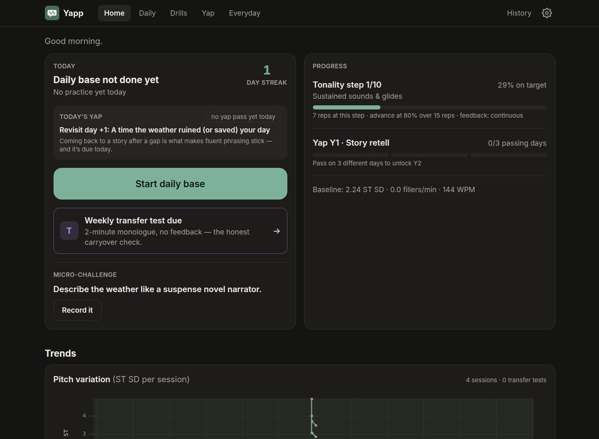
  &nbsp;
  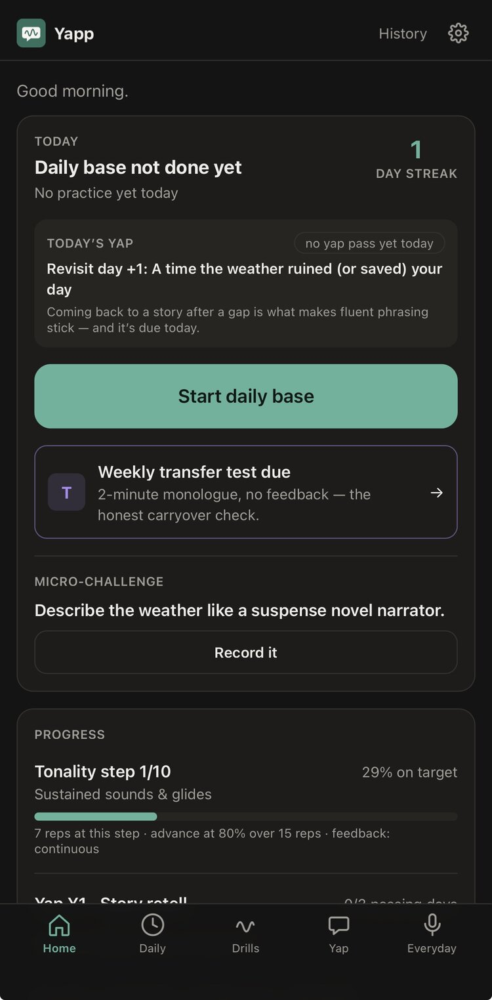
</p>

## Screenshots

| Page | Desktop | iPhone |
|---|---|---|
| **Daily**: the ~18-min base, every step with its *why* | 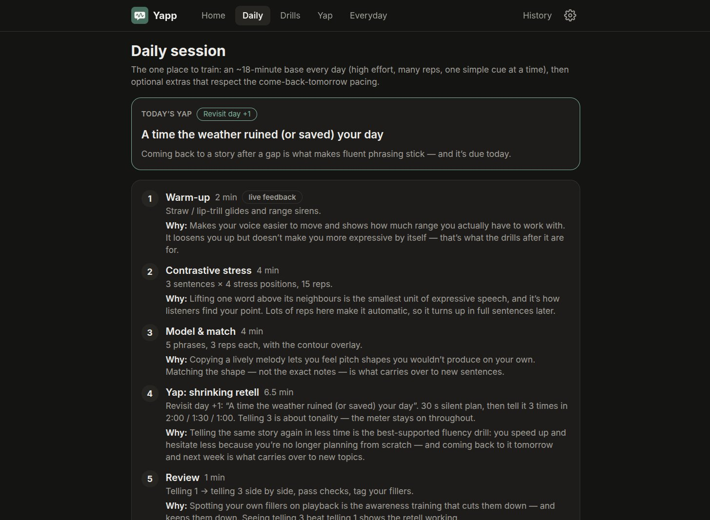 | 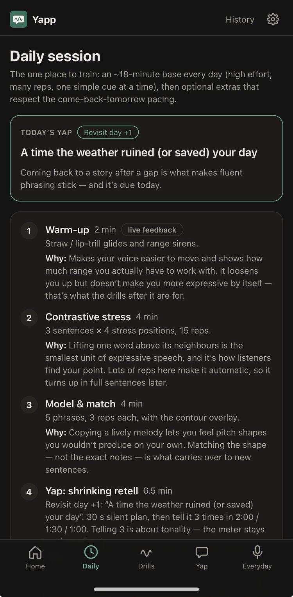 |
| **Yap**: Y1 Story retell → Y4 Chaos | 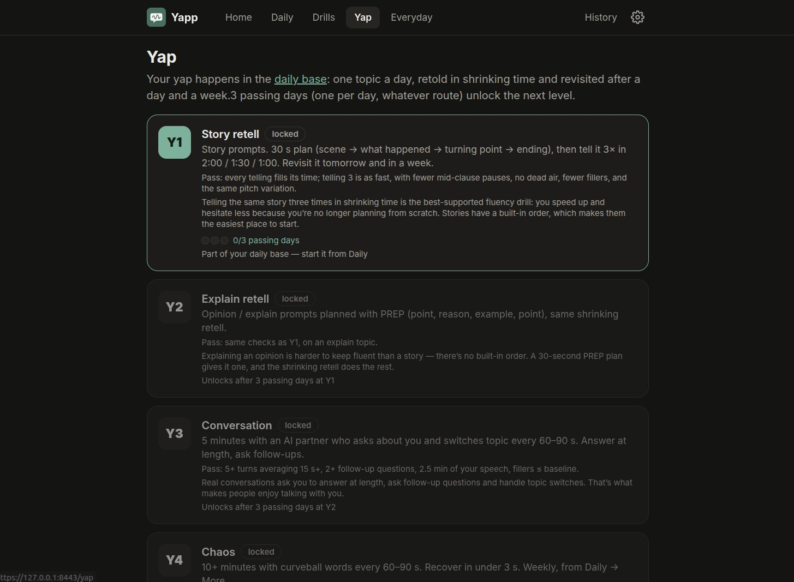 | 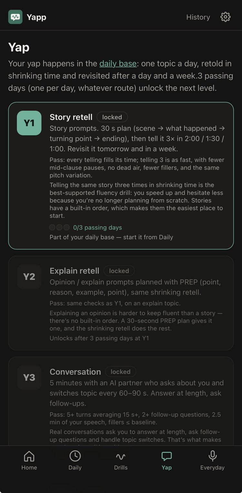 |
| **Drills**: 10-step tonality progression | 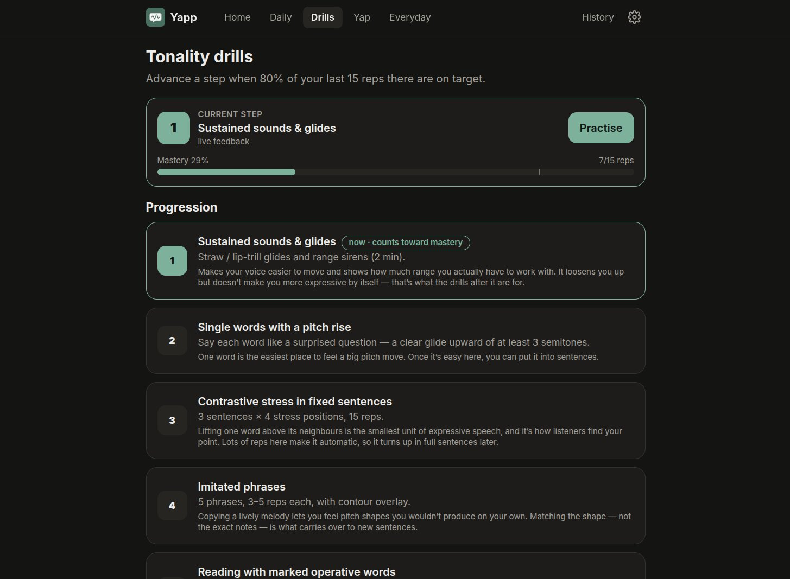 | 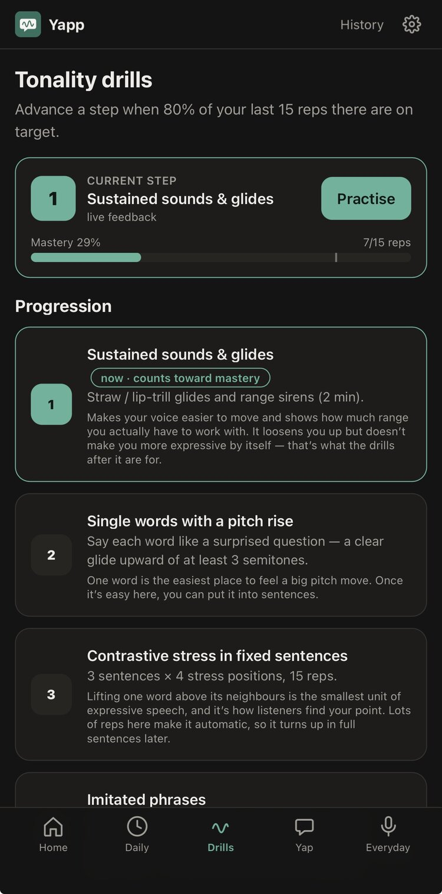 |
| **Everyday**: micro-challenge, real-life log, role-play | 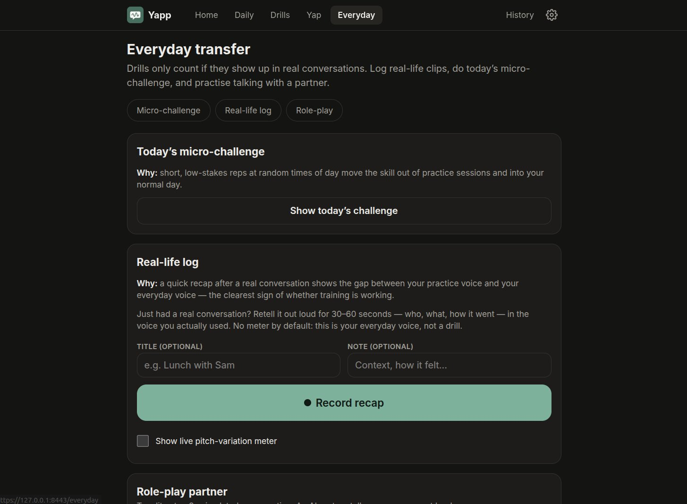 | 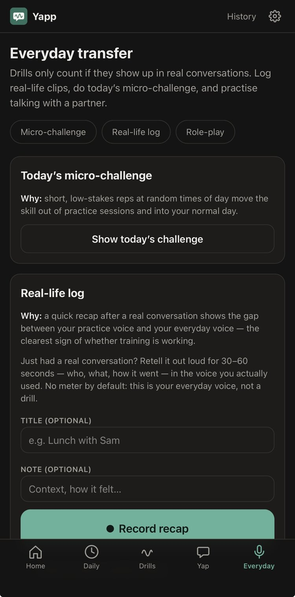 |
| **History**: every session with pitch, pace and fillers | 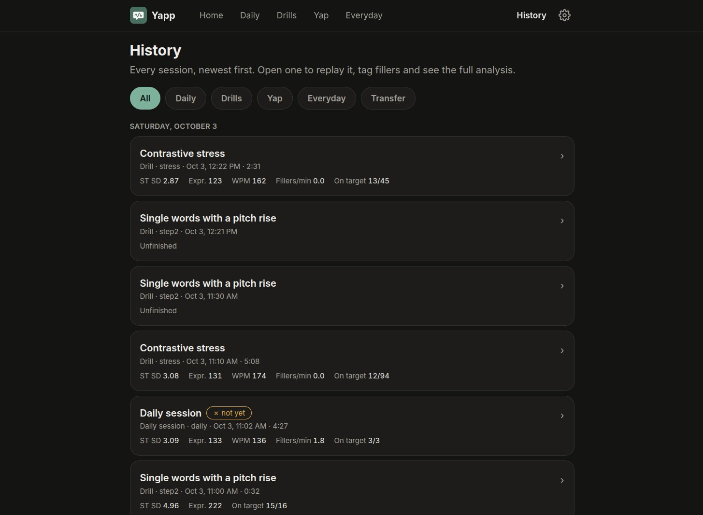 | 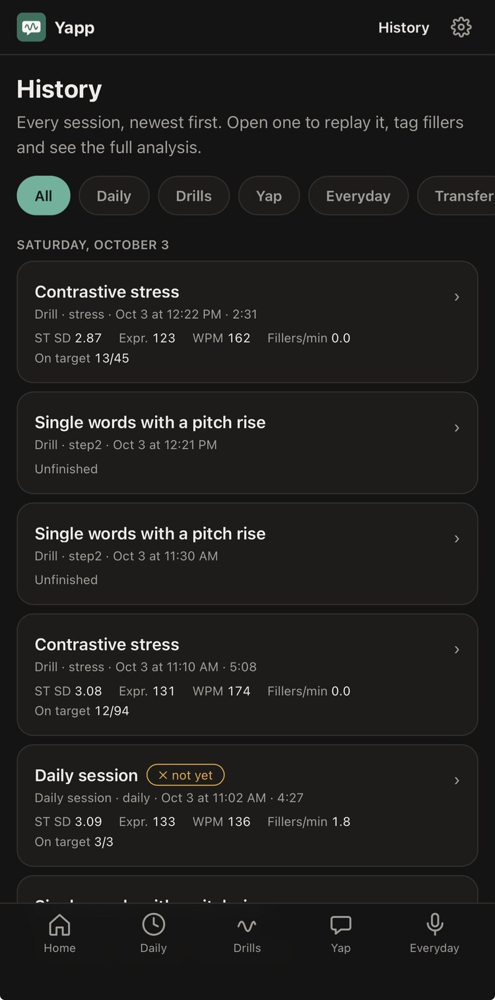 |
| **Settings**: filler cue, partner voice, retell timing | 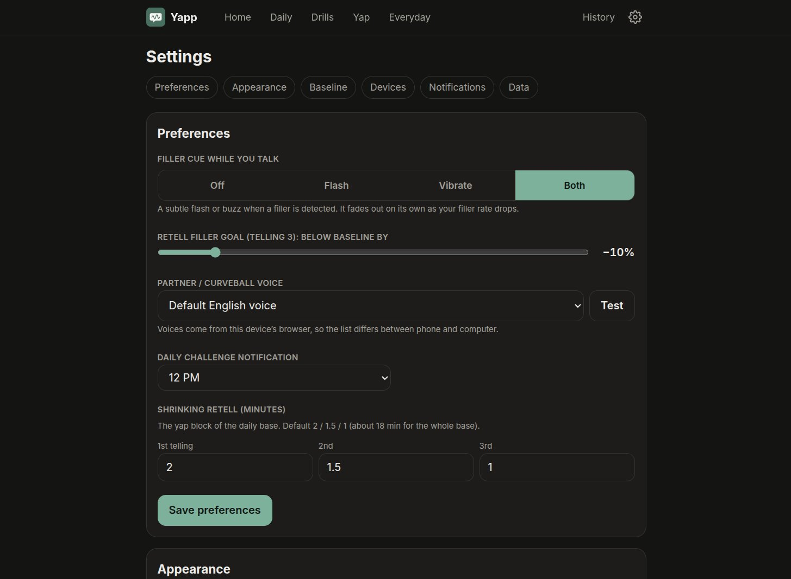 | 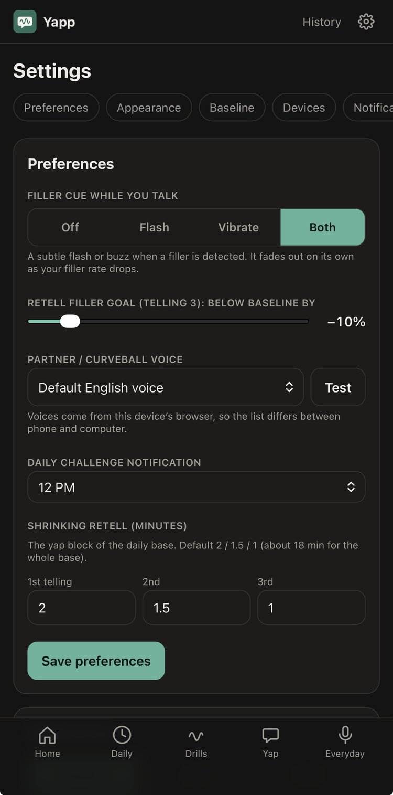 |

## Features

- **One daily session** (`/daily`): warm-up → contrastive stress → model & match → yap block →
  review. Optional extras under **More**, each shown as available / due / done / locked, with
  the reason it's locked.
- **Live feedback while you talk:**
  - a pitch-variation meter (rolling 10 s semitone SD, scaled to your own baseline)
  - a live pitch trace
  - a dead-air clock
  - a subtle filler cue that fades out as you progress
- **Tonality drills** (`/drills`): a 10-step progression. You advance at ≥80% of the last 15
  reps, and feedback fades from continuous → summary → none.
- **Yap stamina levels** (`/yap`):
  - **Y1** Story retell
  - **Y2** Explain retell (PREP)
  - **Y3** Conversation with an AI partner that asks follow-ups and switches topics
  - **Y4** Chaos

  Three passing days unlock the next level. Stories come back on a spaced schedule
  (day 0 → +1 → +7).
- **Transfer and real life:**
  - a weekly no-feedback transfer test
  - a log of real conversations
  - a daily micro-challenge sent by web push
  - an LLM role-play partner
- **Progress:** trends, streaks, drill voice vs everyday voice, and a per-session breakdown
  with transcript, contour and coaching tips.
- **Installable PWA** with HTTPS out of the box. Yapp creates its own local CA, so you don't need
  a reverse proxy or a domain.
- **Your data:** JSON export, delete everything, and a one-command backup.

## How it works

```
 phone / browser (PWA)                       this machine
 ┌──────────────────────┐   HTTPS 8443   ┌─────────────────────────────┐
 │ Astro + Svelte 5     │ ─────────────▶ │ web (Node, SQLite, queue)   │
 │ AudioWorklet capture │                │   │                │        │
 │ live pitch (pitchy)  │                │   ▼                ▼        │
 └──────────────────────┘                │ voice-lab        Ollama     │
                                         │ faster-whisper   qwen3:8b   │
                                         │ + Praat (GPU)    (host)     │
                                         └─────────────────────────────┘
```

| Component | Role |
|---|---|
| `web` | Astro 7 + Svelte 5 app, SQLite via Drizzle, job queue, scoring, progression, web push |
| `voice-lab` | FastAPI: faster-whisper `large-v3-turbo` with word timestamps, Praat (parselmouth) prosody, DTW contour matching |
| Ollama | `qwen3:8b` for topic segmentation, pivot detection, coaching tips and the conversation / role-play partner |

### Metrics

**Per recording**
- **Pitch:**
  - F0 SD in semitones, globally and per 10 s window
  - p5–p95 range
  - phrase slope and final slope
  - per-word peak rise
- **Loudness and voice quality:** dB SD, voicing breaks.
- **Fluency:**
  - WPM and articulation rate
  - mean length of run between pauses of 250 ms or more
  - pauses, and the % of them at clause boundaries
  - dead air
  - fillers per minute and per 100 words
- **Vocabulary:** TTR and MATTR.
- **LLM:** topics, pivots and tips.

**Per session:** an expressiveness score where 100 is your calibrated baseline. After your
first week, the baseline is recomputed from that week's sessions.

## Quick start

Requirements:
- Linux with the **native Docker Engine** (not Docker Desktop, which has no NVIDIA GPU support
  or real host networking on Linux).
- The NVIDIA container toolkit.
- [Ollama](https://ollama.com) on the host with the model pulled: `ollama pull qwen3:8b`.

```sh
cp .env.example .env
npm --prefix web ci && npm --prefix web run hash-password   # paste the APP_PASSWORD_HASH line into .env
mkdir -p data                                                 # create as your user, not root
docker compose up -d --build
```

1. Open **`http://<lan-ip>:8080`** on your phone. A popup offers the Yapp certificate, with
   steps for your OS. Install it once per device.
2. Tap **Continue to HTTPS**, which opens `https://<lan-ip>:8443`, and log in.
3. Run **Calibrate** first: 60 s of free talk plus a short reading. This sets your pitch floor
   and ceiling, your meter bands, and the expressiveness reference (100 = you today).
4. Install the app: browser menu › *Add to Home screen* / *Install app*.

No GPU, e.g. in CI? Run on CPU with Whisper `small`:

```sh
docker compose -f docker-compose.yml -f docker-compose.cpu.yml up -d --build
```

## Configuration

All settings live in `.env`. See [`.env.example`](.env.example) for the full list.

| Variable | Default | Purpose |
|---|---|---|
| `APP_PASSWORD_HASH` | — | Argon2 hash of the login password (`npm --prefix web run hash-password`) |
| `BIND_HOST` | `0.0.0.0` | Comma-separated addresses to listen on, e.g. a VPN interface plus `127.0.0.1` |
| `LAN_IPS` / `HOSTNAMES` | auto | Extra SANs for the certificate. Set `LAN_IPS` to match `BIND_HOST` |
| `HTTPS_PORT` / `HTTP_PORT` | `8443` / `8080` | App and certificate landing page |
| `WHISPER_MODEL` | `large-v3-turbo` | faster-whisper model |
| `OLLAMA_URL` / `OLLAMA_MODEL` | `http://127.0.0.1:11434` / `qwen3:8b` | LLM endpoint |
| `TZ` | `UTC` | Sets what counts as a "day" for streaks and level passes |

### Network binding

- The `web` container uses host networking, so `BIND_HOST` can restrict it to specific
  interfaces, for example WireGuard plus localhost.
- If an interface isn't up yet, the server can't bind to it. Docker keeps restarting the
  container until it can.
- voice-lab only listens on `127.0.0.1:8765`. Ollama is reached on `127.0.0.1:11434`.

### Certificates

- **Root CA:** `data/certs/ca.crt`, valid for 10 years. It is created once and kept, so each
  device installs it only once.
- **Leaf certificate:** re-issued on every start. It is ECDSA P-256, valid for 397 days, and its
  SANs cover `localhost`, the hostname, `HOSTNAMES` and every LAN IP.
- **Fingerprint:** shown on the HTTP landing page and in Settings › Devices. It stays the same
  across restarts.
- **Android:** Chrome may install the PWA as a plain home-screen shortcut, not a WebAPK, on a
  private LAN. The app still works offline either way.

## Development

```sh
cd web && npm ci
npm test                     # Vitest: scoring, fillers, DTW, progression, daily program, yap levels
npx astro check && npm run build
npm start                    # boots certs + HTTP landing + HTTPS app (needs a build)

cd voice-lab && uv venv .venv && uv pip install --python .venv/bin/python -r requirements.txt
.venv/bin/pytest -q          # synthetic signals, no GPU or model download needed
WHISPER_MODEL=base .venv/bin/uvicorn app:app --port 8765
```

When `web` runs outside Docker, set `VOICE_LAB_DATA_DIR` to the same absolute path as `DATA_DIR`,
so voice-lab can find the audio files.

### Layout

```
docker-compose.yml      web (host network, HTTPS 8443 + HTTP 8080) + voice-lab (GPU, 127.0.0.1:8765)
web/src/lib             scoring, DTW, progression, daily program, audio capture
web/src/lib/server      job queue, voice-lab + Ollama clients, finalize, push
web/scripts/certs.mjs   local root CA (once) + leaf cert (every start)
web/server/             start.mjs (boot), http.mjs (cert landing page + CA download)
voice-lab/              FastAPI: faster-whisper + parselmouth prosody, DTW (docs/voice-lab-api.md)
scripts/backup.sh       SQLite snapshot + audio + certs → backups/yapp-<date>.tar.gz
data/                   SQLite DB, audio, certs, Whisper models (volume, gitignored)
```

## Backups

`scripts/backup.sh [dest]` writes a consistent SQLite snapshot, the audio and the certs into a
tarball and keeps the last 14. Keep the root CA, or every device will have to reinstall it.
Settings › Data can also export everything as JSON or delete all practice data.

## Disclaimer

Yapp is a practice tool, not a medical device. If you have a voice or speech disorder, see a
speech-language pathologist.
